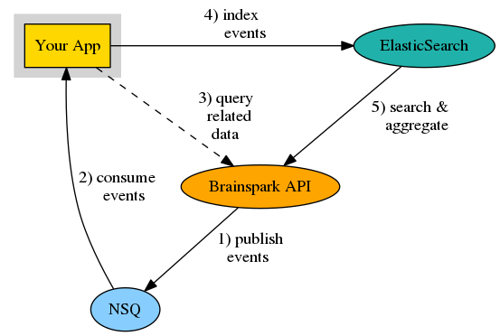

# Mindflash Backend Coding Exercise
Our goal is to give you a small coding challenge that gives you a chance to show off your skills and also gives you a small idea of some of the problems that you may encounter at Mindflash. We know you're busy with life, so our aim is to have you spend no more than 2 hours working through this exercise. We don't expect you to finish in 2 hours, so don't worry if you can't. Submit what you have along with some notes on your thoughts and how you would proceed if you have more time. Most importantly, try to have some fun with it!

**Lastly, your code is yours to keep, publish, delete, or blog about. However, please no mentions of Mindflash should you choose to share or publish it.**

## Task
Your task is to build a small application using that filters, transforms, and indexes a stream of events from NSQ (a real-time distributed messaging platform) into Elasticsearch (a highly performant and scalable search/aggregation engine).

<p align="center">

</p>

This repository includes a number of resources to help you get started, including documentation, code samples, and a [docker compose](https://docs.docker.com/compose/overview/) file that you can use to set up your local/test environment.

## Overview
You just got hired to join the *badass* engineering team at *BrainSpark* (a fictional LMS)! The first story in your sprint backlog is to build an application that indexes a stream of events into ElasticSearch for use in reporting and anaytics. For reference, the domain model of our application for the exercise is shown below:

<p align="center">

</p>

At a high level:
- Our product supports multiple accounts
- Each account has many courses and many users
- A user may attempt a course many times
- Users can perform actions that trigger events

Our focus for this exercise are the domain events. Events are published on an [NSQ Topic](http://nsq.io). An event message represents a single event and is serialized as JSON. A sample event is shown below: 

###### Sample Event Message
```json
{
    "id": "5c92de28-14f0-449e-821b-e61e871179c2",
    "attempt_id": "e70a6ecf-f308-4306-831d-bb41c851061d",
    "progress": 0.63414633,
    "score": 0.96158886,
    "timestamp": "2018-01-16T14:09:51.655185082-07:00",
    "type": "PROGRESS",
    "user_id": "471de972-520c-4f44-bd6d-34cc98dd5e6e"
}
```

Prior to indexing the event records into ES, you will need to apply the following transformations:
- filter out invalid messages (ie messages that do not pass the schema above)
- filter out events with type `FOO`
- denormalize the event by *hydrating* (ie *embedding*) the related attempt, course, trainee, and user (if available) using the *BrainSpark* JSON-RPC API (see *resources* section below for more info)

An example of a successful transformation is shown below:

###### Sample Transformed ElasticSearch Document
```json
{
    "id": "5c92de28-14f0-449e-821b-e61e871179c2",
    "timestamp": "2018-01-16T14:09:51.655185082-07:00",
    "type": "PROGRESS",
    "attempt_id": "e70a6ecf-f308-4306-831d-bb41c851061d",
    "progress": 0.63414633,
    "score": 0.96158886,
    "user_id": "471de972-520c-4f44-bd6d-34cc98dd5e6e",
    "attempt": {
        "id": "e70a6ecf-f308-4306-831d-bb41c851061d",
        "course_id": "9a3c3136-c24d-4fb6-94fe-7ba6aa491080",
        "created_at": "2017-07-09T00:45:24.466Z",
        "trainee_id": "747f457c-7e74-400e-9b0e-071d1c693ea4",
    },
    "course_id": "9a3c3136-c24d-4fb6-94fe-7ba6aa491080",
    "course": {
        "id": "9a3c3136-c24d-4fb6-94fe-7ba6aa491080",
        "account_id": "aacf3f09-4b19-424f-995a-4b13f8e36365",
        "name": "hot dog vs not hot dog"
    },
    "trainee_id": "747f457c-7e74-400e-9b0e-071d1c693ea4",
    "trainee": {
        "id": "747f457c-7e74-400e-9b0e-071d1c693ea4",
        "account_id": "aacf3f09-4b19-424f-995a-4b13f8e36365",
        "first_name": "erlich",
        "last_name": "bachman",
        "email": "e.bachman@bachmanity.com"
    },
    "user": {
        "id": "471de972-520c-4f44-bd6d-34cc98dd5e6e",
        "account_id": "aacf3f09-4b19-424f-995a-4b13f8e36365",
        "first_name": "jin",
        "last_name": "yang",
        "email": "jin.yang@seefood.com"
    }
}
```

The events need to be indexed into Elasticsearch using `event` as the document type and index `events-YYYY-MM-DD`, where `YYYY-MM-DD` is replaced using the formatted event `timestamp` attribute. *Note: you do not need to preallocate the indices, they will be created on first index*. 

## Resources

- [NSQ Design Overview](http://nsq.io/overview/design.html)
    - [nsqjs](https://github.com/dudleycarr/nsqjs) node client
    - [go-nsq](https://github.com/nsqio/go-nsq) go client
- [Elasticsearch Document API](https://www.elastic.co/guide/en/elasticsearch/reference/5.5/docs.html)
    - [elasticsearch.js](https://www.elastic.co/guide/en/elasticsearch/client/javascript-api/current/index.html) node client
    - [elastic](https://github.com/olivere/elastic) go client
- [BrainSpark API](./docs/README.md)
- [JSON RPC](http://www.jsonrpc.org/specification)
- [a sample json event](./docs/sample-event.json)

## Getting Started
The only prerequisites for using this repository are [Docker](https://www.docker.com/what-container) & [Compose](https://docs.docker.com/compose/overview/). Installation links are below:
- [Docker](https://store.docker.com/search?type=edition&offering=community)
- [Compose](https://docs.docker.com/compose/install/)

To start the local environment:
```shell
$ docker-compose up -d

```
*Note: This command will start NSQ, ElasticSearch, and the BrainSpark container. It may take a few minutes the first time you run it, as it will have to pull the images for NSQ and ElasticSearch and build the BrainSpark image locally. By default, NSQ will be mapped to localhost:4150, ElasticSearch will be mapped to localhost:9200, and the BrainSpark application will be listening on port 8080. You can change these mappings and other configurations by editing the docker-compose.yml file*

## Requirements
- you may build your application using `node.js`, `go`, or `.net`
- you should include a `Dockerfile` in the root of your repository
- your code should be linted
    - nodejs: use `eslint` with `eslint-config-airbnb-base`
    - go: use `golint`
- your code should include a couple tests
- your code should include a `README.md` file in the root with instructions for building, running, and testing. It can also include notes on your throught process and any issues you may have run into.

## Evaluation
We will evaluate your submission using the following criteria
- Is your application well organized?
- Is your code documented?
- Is your code efficient & performant?

## Submission
Please upload this repository to Github and submit to @jgiless when complete.